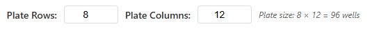
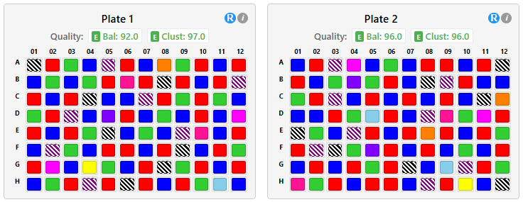
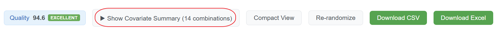
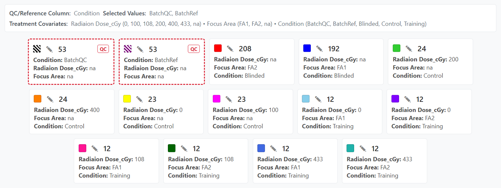

# Octopus

## What is Octopus?

Octopus is a web application designed to optimize the distribution of experimental samples across multiple plates (e.g., 96-well plates). The tool ensures that samples are distributed in a balanced and randomized manner, helping researchers minimize bias and maintain statistical validity in their experiments.

### Key Purposes

**Balanced Distribution**: The app ensures each plate contains a representative mix of sample types based on your selected covariates (such as treatment, time points, dose levels, or other experimental factors).

**Spatial Randomization**: Samples are positioned on plates to minimize clustering of similar samples in rows and columns, reducing potential position-based biases.

**Repeated Measures Support**: For longitudinal studies where patients have multiple samples across timepoints, the app can keep all samples from the same patient together on the same row or the same plate.

**Quality Assessment**: Built-in metrics evaluate how well your sample distribution achieves balance and randomization, helping you identify and correct issues before running experiments.

**Flexible Configuration**: Customizable plate dimensions allow you to adapt the randomization strategy to your specific experimental needs.

---

## How Octopus Works

### The Randomization Process

Octopus supports two randomization modes depending on your experimental design:

#### Standard Randomization (no Subject ID column selected)

1. **Sample Classification**: Your samples are grouped based on selected covariates (experimental factors like treatment type, time point, etc.)

2. **Proportional Distribution**: Samples are distributed across plates so that each plate receives a proportional representation of each covariate group

3. **Spatial Placement**: Within each plate, samples are positioned using a greedy process that minimizes adjacency (horizontal, vertical, cross-row) of identical covariate groups. Randomness is introduced via shuffling and tie-breaking, but the primary objective is reduced clustering rather than pure uniform randomness.

4. **Quality Evaluation**: Balance and clustering scores are calculated to assess the quality of the distribution

#### Repeated Measures Randomization (Subject ID column selected)

For longitudinal or repeated measures studies, a specialized pipeline keeps all samples from the same patient together:

1. **Subject Grouping**: Samples are grouped by the Subject ID column. All samples sharing the same patient ID form a group that is kept together throughout the pipeline.

2. **QC Distribution**: QC/Reference samples are distributed evenly across plates and rows first, establishing the effective capacity available for experimental samples.

3. **Plate Assignment**: Patient groups are assigned to plates using First-Fit-Decreasing (FFD) bin packing. The algorithm places the largest groups first, choosing the plate with the most remaining capacity. When plates are tied on capacity, covariate balance is used as a tiebreaker.

4. **Row Assignment**: Within each plate, patient groups are assigned to rows. The algorithm first determines a "recipe" (how many groups of each size go in each row) using backtracking search, then assigns specific patient groups to slots using covariate balance scoring. If no valid recipe exists, a greedy fallback is used.

5. **Column Placement**: Samples are placed into specific columns within each row to minimize spatial clustering.

6. **Quality Evaluation**: Balance and clustering scores are calculated, same as standard randomization.

See [Repeated Measures Algorithm Details](#repeated-measures-algorithm-details) for an in-depth description.

---

## How to Use Octopus

### Step 1: Upload Your Data

Prepare a CSV file containing your sample information with:
- A unique identifier column for each sample
- One or more columns representing experimental covariates (factors you want to balance)
- For repeated measures: a column identifying the patient/subject each sample belongs to

Click **Choose File** to select and upload your CSV file.

### Step 2: Configuration

#### Select ID Column
Choose which column contains your unique sample identifiers. The app will automatically select common identifier column names like "_UW_Sample_ID_" or "_search name_".

#### Choose Covariates
Select which experimental factors should be balanced across plates. You can select multiple covariates (e.g., Treatment, Time Point, Dose Level). The selected covariates will be displayed below the selection box.
Each unique combination of the selected covariate values becomes a distinct "covariate group". Internally the app concatenates the selected column values with a `|` separator to form a covariate group key (e.g. `Treatment|Time|Dose`). All samples sharing the same combination are pooled together for proportional distribution.

Example:

| Sample_ID | Treatment | Time | Dose |
|-----------|----------|------|------|
| S1        | DrugA    | 0h   | Low  |
| S2        | DrugA    | 0h   | Low  |
| S3        | DrugA    | 24h  | Low  |
| S4        | DrugB    | 0h   | High |
| S5        | Control  | n/a   | n/a  |

If you select Treatment + Time, the covariate group keys are:
`DrugA|0h` (S1,S2), `DrugA|24h` (S3), `DrugB|0h` (S4), `Control|n/a` (S5).

If you select Treatment + Time + Dose, the keys are:
`DrugA|0h|Low` (S1,S2), `DrugA|24h|Low` (S3), `DrugB|0h|High` (S4), `Control|n/a|n/a` (S5).

These groupings drive plate-level and row-level expected minimum calculations and distribution.

#### Set QC/Reference Samples (Optional)
Select a column that identifies quality control or reference samples, then check the values that represent QC/reference samples.

**How it works:**
1. Select a column from the "QC/Reference Column" dropdown (e.g., "Sample_Type")
2. Check the boxes for values that represent QC/Reference samples (e.g., "QC", "Reference")
3. Samples with these values will be marked as QC/Reference samples

**Covariate key generation:**
- If the QC column is NOT selected as a treatment covariate, the QC value is prepended to the covariate key (e.g., `QC|DrugA|0h`)
- If the QC column IS selected as a treatment covariate, it's treated like any other covariate (no prefix)

QC/Reference samples will be visually distinguished in the summary panel (see Covariate Summary Panel section below).

#### Set Subject ID Column (Optional — Repeated Measures)

Select the column that identifies which patient or subject each sample belongs to. When a Subject ID column is selected:

- All samples sharing the same Subject ID form a group that will be kept together
- A **Grouping Constraint** selector appears with two options:
  - **Same Row**: All samples from the same patient must be placed in the same row. Use this when you want the tightest grouping (e.g., to minimize row-to-row variation for the same patient).
  - **Same Plate**: All samples from the same patient must be on the same plate, but can be in different rows. Use this when patient groups are too large to fit in a single row, or when plate-level grouping is sufficient.
- A summary shows the number of subject groups, their sizes, and any singletons (samples with no Subject ID)

**Choosing a constraint:**
- Start with **Same Row** for tighter grouping. If you get an error that groups don't fit in rows, switch to **Same Plate** or increase the plate column count.
- **Same Plate** is more flexible and can handle larger patient groups, but provides weaker spatial grouping.

#### Configure Plate Dimensions
- **Rows**: Set from 1-16 (default: 8)
- **Columns**: Set from 1-24 (default: 12)
- The total plate capacity (rows x columns) is displayed automatically



**Plate dimensions and repeated measures:** When using the Same Row constraint, the number of columns must be at least as large as the biggest patient group. For example, if a patient has 9 timepoints, you need at least 9 columns. The app validates this before randomization and will display an error if any group is too large for the row.

#### Choose Empty Cell Distribution
When your sample count doesn't fill all available wells, use the **"Keep empty spots in last plate"** checkbox:

- **Checked** (default): All empty wells are concentrated in the final plate, keeping all other plates fully populated
- **Unchecked**: Empty wells are distributed across all plates and available rows, creating a more uniform fill level across all plates

This setting affects plate capacity calculations and can impact how samples are distributed across plates.

### Step 3: Generate Randomized Plates

Click the **"Generate Randomized Plates"** button to create your sample distribution.

If validation errors are detected (e.g., groups too large for rows, insufficient plate capacity), error messages will appear explaining the issue and suggesting fixes.

### Step 4: Review and Evaluate

#### View Modes

**Compact View** (Default)
- Small cells (18x16 pixels)
- Ideal for visualizing overall distribution patterns
- Hover over cells to see sample details



**Full Size View**
- Large cells (100x60 pixels) display complete information
- Sample names and covariate values visible directly in each well
- Better for detailed inspection


Switch between views using the **"Compact View"** / **"Full Size View"** button.

#### Subject Placement Panel (Repeated Measures)

When a Subject ID column is selected, a **"Show/Hide Subject Placements"** button appears. This panel lists every patient and shows:
- How many samples (timepoints) they have
- Which plate(s) and row(s) their samples were placed on
- Click a patient to highlight all of their samples across all plates

This is useful for verifying that the grouping constraint was respected (e.g., all samples for a patient are in the same row or plate).

#### Covariate Summary Panel

Click **"Show/Hide Covariate Summary"** to display:
- All unique covariate groups with color indicators
- Sample counts for each group (sorted from most to least samples)
- Values for each covariate in the group





**QC/Reference Visual Indicators** (if QC/Reference samples are configured):
- QC/Reference covariate groups are displayed with a **red dashed border**
- A **"QC" badge** appears on these groups
- These groups are **listed first** in the summary panel for easy identification

**Interactive Highlighting**: Click any covariate group in the summary to highlight all samples from that group across all plates (blue glowing border).


#### Quality Metrics

**Overall Quality Button**: Shows experiment-wide quality score and level (Excellent, Good, Fair, Poor, or Bad)

Click the quality button to open the **Quality Assessment Modal** showing:
- Overall quality score and level
- Average balance and clustering scores across all plates
- Individual scores for each plate with quality badges

**Plate Headers**: Each plate displays:
- **Bal**: Balance score (0-100) for that plate
- **Clust**: Clustering score (0-100) for that plate
- **Overall**: Combined score displayed with color-coded quality badge

#### Plate Details Popup

Click the **"i"** icon in any plate header to view:
- Plate capacity and sample count
- Quality scores (balance and clustering)
- Detailed breakdown of each covariate group on that plate:
  - Color indicator matching the plate display
  - Sample proportions (plate count / total group count)
  - Expected vs. actual sample counts
  - Deviation percentages
  - Individual balance scores


### Step 5: Refine Your Randomization (Optional)

#### Global Re-randomization
Click the main **"Re-randomize"** button to generate a completely new distribution for all plates while preserving your configuration settings.

#### Individual Plate Re-randomization
Click the **"R"** button in any plate header to re-randomize only that specific plate. Quality scores update automatically after any re-randomization.

**Note on repeated measures re-randomization:** The row composition recipe (how many groups of each size go in each row) is deterministic — it does not change between re-randomizations. What changes is which specific patients fill which slots, the order of rows on the plate, and the column positions within rows.

### Step 6: Export Your Results

Once satisfied with the distribution, click **"Download CSV"** or **"Download Excel"** to save your plate assignments.

**CSV Export**: Includes all original sample data plus assigned plate numbers and well positions.

**Excel Export**: Opens a modal allowing you to select which covariates to include in the Excel file. The exported file contains:
- Color-coded plates matching the visual display
- Selected covariate information for each sample
- Plate and well position assignments

---

## Understanding Quality Scores

### Balance Score (0-100)
Measures how proportionally each covariate group is represented on each plate compared to the overall population. Higher scores indicate better balance.

**Calculation:**
For each covariate group on each plate:
```
Actual Proportion = Actual Count / Plate Capacity
Expected Proportion = Group Size / Total Samples
Relative Deviation = |Actual Proportion - Expected Proportion| / Expected Proportion
```

The overall plate balance uses weighted averaging based on global covariate group proportions, ensuring large groups influence the score proportionally while very rare groups have limited impact.

### Clustering Score (0-100)
Measures spatial clustering by counting same-covariate group adjacencies across the entire plate. The score evaluates three types of adjacencies:
- **Horizontal**: Same row, adjacent columns (left-right neighbors)
- **Vertical**: Same column, adjacent rows (up-down neighbors)
- **Cross-row**: Last column of row N adjacent to first column of row N+1

The score is calculated as: `Score = (1 - actualClusters / maxPossibleAdjacencies) x 100`

Higher scores indicate better spatial distribution with fewer same-treatment samples adjacent to each other. A score of 100 means no same-treatment adjacencies, while lower scores indicate more clustering.

### Overall Score
The average of balance and clustering scores, calculated at both plate level and experiment level.

### Quality Levels

| Score Range | Quality Level |
|-------------|---------------|
| 90-100 | Excellent |
| 80-89 | Good |
| 70-79 | Fair |
| 60-69 | Poor |
| 0-59 | Bad |

---

## Tips for Best Results

1. **Select Relevant Covariates**: Choose only the experimental factors that matter for your analysis. Too many covariates can make it difficult to achieve a balanced distribution.

2. **Use QC/Reference Column**: Specifying QC/Reference labels helps you quickly identify these samples in the plate layout.

3. **Inspect Distributions**: Use the covariate summary and interactive highlighting to verify that key sample groups are well-distributed across plates.

4. **Use Compact View First**: Start with the compact view to identify any obvious distribution issues, then switch to full size for detailed verification.

5. **Check Plate Details**: Review the plate details popup for each plate to ensure expected counts align with actual counts.

6. **For Repeated Measures**: Use the Subject Placement Panel to verify that all samples for each patient are grouped correctly according to your chosen constraint. Click on individual patients to highlight their samples across plates.

7. **Adjust Plate Dimensions for Repeated Measures**: If you get errors with the Same Row constraint, try increasing the column count so rows are wide enough for your largest patient group, or switch to Same Plate constraint.

---

## Color Coding

The app uses 24 distinct bright colors to represent different covariate groups. For experiments with more groups:

- **Groups 1-24**: Solid color fill
- **Groups 25-48**: Outline only (transparent fill)
- **Groups 49-72**: Diagonal stripes pattern

This system supports up to 72 unique covariate groups while maintaining visual distinction.

**QC/Reference Sample Colors**: When QC/Reference samples are configured, their covariate groups are assigned darker color variants from a separate palette. This makes QC/Reference samples easily distinguishable from treatment samples at a glance, helping you quickly verify their distribution across plates.

---

## Technical Details

### Standard Randomization Algorithm

**Balanced Randomization**
- Distributes samples proportionally across plates and rows
- Uses greedy spatial placement to minimize adjacency clustering

Detailed Steps:
1. **Grouping**: Samples are grouped by concatenated covariate values (e.g. `Treatment|Time|Dose`).
2. **Plate Capacity Assignment**: Plate capacities are computed based on total sample count, plate size and whether empty wells are concentrated in the final plate or spread across plates.
3. **Expected Minimums (Plate Level)**: For every (plate, group) an expected minimum count is computed from `floor(groupSize / numPlates)` scaled by plate capacity ratio (for partial plates). Prevents early overfilling.
4. **Phase 1 Proportional Placement**: Baseline expected minimum samples for each group are placed into plates. Remaining samples are tagged as either unplaced (group too small for baseline) or overflow (extras beyond baseline).
5. **Phase 2A (Unplaced Groups)**: Small groups are added to plates prioritizing those with the most remaining capacity -- spreads rare groups.
6. **Phase 2B (Overflow Samples)**: Remaining samples of larger groups are added with a prioritization strategy: plate level prefers higher-capacity plates; row level prefers rows currently containing fewer of that group.
7. **Row Distribution**: For each plate, rows are treated as mini-blocks; the same proportional + overflow logic is applied using row capacities.
8. **Greedy Spatial Placement**: Within each populated row, samples are placed into columns minimizing a cluster score (penalties for same-group left/right/above and cross-row adjacency). Random tie-breaking preserves diversity.
9. **Final Spatial Metrics**: Horizontal, vertical and cross-row cluster counts logged for diagnostic quality analysis.

### Repeated Measures Algorithm Details

The repeated measures algorithm handles longitudinal studies where multiple samples from the same patient must be kept together. It uses a sequential pipeline:

```
Input CSV
  -> buildSubjectGroups()        Group samples by patient ID
  -> distributeQcByCovariate()   Spread QC samples evenly across plates/rows
  -> distributeGroupsToPlates()  Assign patient groups to plates (FFD + covariate balance)
  -> distributeGroupsToRows()    Assign patient groups to rows within each plate
  -> greedyPlaceInRow()          Place samples into specific columns within each row
```

#### Stage 1: Subject Grouping

All samples sharing the same Subject ID become a single group that is kept together throughout the pipeline. Samples with empty or missing Subject IDs become singletons (group of size 1).

#### Stage 2: QC Distribution

QC samples are distributed proportionally across plates and rows before experimental samples. For each QC covariate subgroup (e.g., BatchQC vs BatchRef):
1. Divide count evenly across plates, with remainders distributed randomly.
2. Within each plate, divide evenly across rows, with remainders distributed randomly.

This establishes the effective row capacities (total wells minus QC allocations) that constrain the rest of the pipeline.

#### Stage 3: Plate Assignment (FFD Bin Packing)

Patient groups are assigned to plates using First-Fit-Decreasing:

1. Sort groups by size descending, shuffling groups of equal size.
2. For each group, find all plates with enough remaining well capacity.
3. Among candidates with the **most remaining capacity**, pick the plate with the **lowest covariate imbalance score**.
4. Ties are broken randomly.
5. After all multi-sample groups are placed, singletons are distributed the same way.

The capacity-first rule creates a natural alternation effect: after one plate accepts a group and loses capacity, the next group tends to go to a different plate. This produces near-even distribution across plates without requiring explicit balancing logic.

**Same Row guard**: When using the Same Row constraint, each plate also has a row-slot budget limiting how many multi-sample groups it can accept, based on how many groups physically fit in its rows. This prevents overloading a plate with groups that can't be arranged into rows later.

#### Stage 4: Row Assignment (Recipe Search + Covariate Balancing)

This is the most complex stage. It works in two phases:

**Phase 1 — Recipe Search**: Instead of deciding which specific patient goes where, Phase 1 determines how many groups of each size go in each row. This is called a "recipe." A backtracking search explores valid combinations, pruning infeasible branches early.

The search runs in two passes with different enumeration orders to generate recipe diversity:
- **Pass 1**: Explores mixed-size compositions first (e.g., 2 size-3 groups + 2 size-2 groups per row)
- **Pass 2**: Explores greedy-fill compositions first (e.g., 3 size-3 groups per row)

Recipes are scored by estimated covariate balance — how well the expected covariate distribution in each row would match the global proportions, given the composition of groups available in the pool. The best-scoring recipe is selected.

Phase 1 is deterministic: given the same group sizes and row capacities, it always produces the same recipes.

**Phase 2 — Group Assignment**: Once the best recipe is selected, specific patient groups are assigned to the recipe's slots. Groups of each size are shuffled, then assigned to rows one at a time, choosing the assignment that produces the best covariate balance (measured by sum of squared deviations from global covariate proportions).

**Fallback**: If the recipe search finds no valid recipes (iteration budget exhausted), a greedy FFD fallback assigns groups to rows by remaining capacity with covariate-balance tiebreaking.

#### Stage 5: Row Reordering

After groups are assigned to rows, the physical row order is rearranged to minimize vertical adjacency of same-covariate groups. Starting from a random row, each subsequent row is chosen to be maximally different from the previous one.

#### Stage 6: Column Placement

Within each row, samples are placed into specific columns using greedy spatial placement that minimizes adjacency of same-covariate samples (same algorithm as standard randomization).

#### Error Messages

The algorithm validates feasibility at multiple points and produces diagnostic error messages when placement is not possible:

- **Group too large for row**: If any patient group has more samples than the row capacity (number of columns), it cannot fit in a single row under the Same Row constraint. The error message names the patient and suggests increasing plate dimensions or switching to Same Plate constraint.
- **Plate capacity exhaustion**: If plates run out of capacity during FFD placement, the error reports remaining plate capacities and explains which group sizes cannot find qualifying plates (plates with enough wells).
- **Row capacity exhaustion**: If rows within a plate run out of capacity, the error reports remaining row capacities and explains which group sizes cannot find qualifying rows (rows with enough wells), including how many slots those rows provide.

These shape-aware messages help distinguish between total capacity being insufficient and the geometric constraint that groups of certain sizes cannot share rows or plates effectively.

### Quality Score Calculations

#### Balance Score
For each covariate group on each plate, the balance score evaluates how closely the actual sample distribution matches the expected proportional distribution:

```
Actual Proportion = Actual Count / Plate Capacity
Expected Proportion = Group Size / Total Samples
Relative Deviation = |Actual Proportion - Expected Proportion| / Expected Proportion
Balance Score = max(0, 100 - (Relative Deviation x 100))
```

The overall plate balance uses weighted averaging based on global covariate group proportions. Each group's relative deviation is multiplied by its global expected proportion, ensuring large groups influence the score proportionally while very rare groups have limited impact:

```
WeightedDeviation(group) = RelativeDeviation(group) x GlobalExpectedProportion(group)
OverallWeightedDeviation = Sum of WeightedDeviation / Sum of GlobalExpectedProportion
PlateBalanceScore = max(0, 100 - (min(OverallWeightedDeviation, 1) x 100))
```

Group-level balance scores are listed separately to identify which combinations drive penalties.

#### Clustering Score
The clustering score measures spatial distribution quality by analyzing same-treatment adjacencies:

**Calculation Method:**
1. **Count actual clusters**: For each filled position, check if adjacent positions (right, below, cross-row) contain samples from the same treatment group
   - Horizontal adjacency: Same row, next column
   - Vertical adjacency: Same column, next row
   - Cross-row adjacency: Last column of row N to first column of row N+1

2. **Calculate maximum possible adjacencies**: Count all potential adjacency pairs between filled positions

3. **Compute clustering ratio**: `clusterRatio = totalClusters / maxPossibleAdjacencies`

4. **Convert to score**: `ClusteringScore = (1 - clusterRatio) x 100`

**Score Interpretation:**
- **100**: Perfect distribution - no same-treatment adjacencies (ideal checkerboard pattern)
- **75-99**: Good distribution - minimal clustering
- **50-74**: Moderate clustering - some same-treatment neighbors
- **0-49**: High clustering - many same-treatment adjacencies

**Special Cases:**
- Empty plates or single-sample plates: Score = 100 (no adjacencies possible)
- No possible adjacencies: Score = 100

The clustering score complements the balance score by ensuring samples are not only proportionally distributed but also spatially dispersed to minimize position-based biases.

#### Overall Scores
- **Plate Overall Score** = (Balance Score + Clustering Score) / 2
- **Experiment Scores** = Average of all plate scores

---

## Troubleshooting

### Low Balance Scores

**Possible causes:**
- Too many covariates selected
- Some covariate groups are very small
- Uneven sample distribution

**Solutions:**
- Try using fewer covariates
- Use the "Re-randomize" button
- Check plate details to identify problematic groups

### Low Clustering Scores

**Possible causes:**
- Large groups naturally cluster more
- Random placement resulted in adjacent same-group samples

**Solutions:**
- Re-randomize individual plates with low scores
- Manually move samples to reduce clustering

### Repeated Measures Errors

**"Subject X has N samples, which exceeds the row capacity"**
- The patient has more timepoints than the row has columns
- **Fix**: Increase the number of columns, or switch to Same Plate constraint

**"Unable to fit all subject groups into available plates"**
- The combination of group sizes exhausted plate capacity before all groups could be placed
- The error message shows remaining plate capacities and which group sizes lack qualifying plates
- **Fix**: Add more plates, increase plate dimensions, or switch to Same Plate constraint

**"Unable to fit all subject groups into available rows"**
- Groups were assigned to a plate but can't be arranged into its rows
- This can happen when groups of different sizes can't share rows efficiently (e.g., a size-5 group and a size-3 group can't share a 7-column row because 5 + 3 = 8 > 7)
- The error message shows remaining row capacities and which group sizes lack qualifying rows
- **Fix**: Increase the number of columns (so groups of different sizes can share rows), or switch to Same Plate constraint

**"Cannot fit N subject groups of size X into available rows"**
- Pre-validation detected that there aren't enough row slots for groups of a particular size, even before attempting placement
- **Fix**: Increase plate dimensions or switch to Same Plate constraint

---
