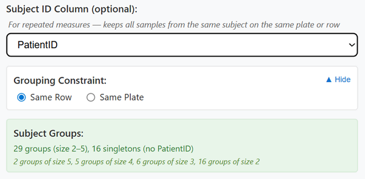
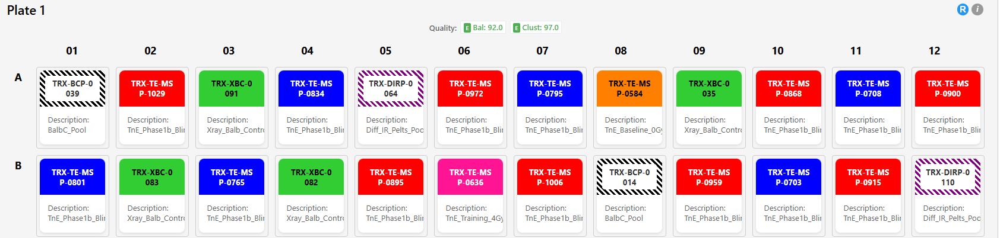
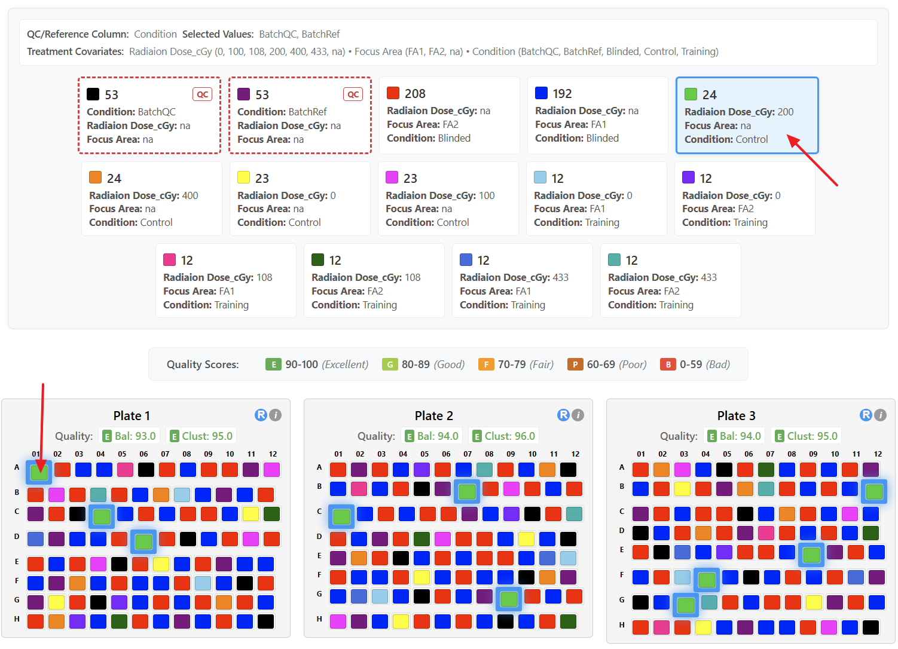
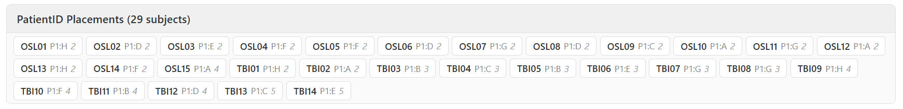
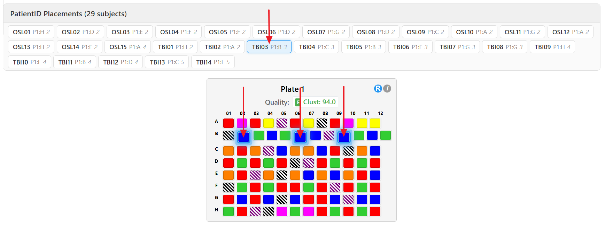
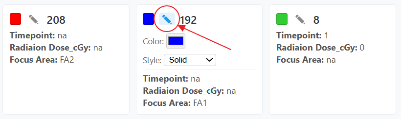
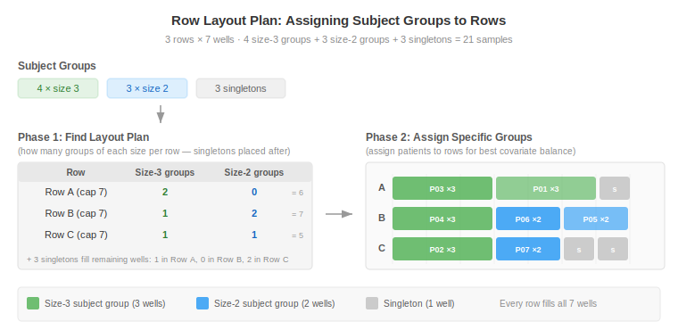
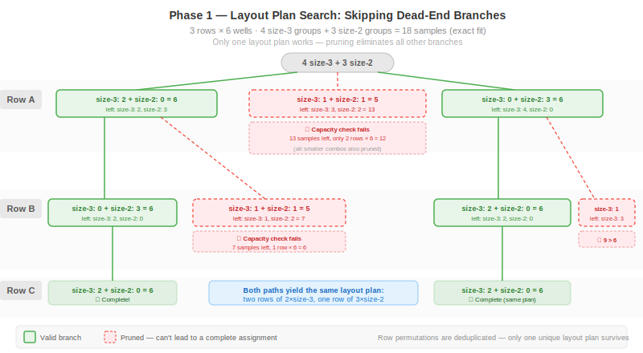

# Octopus Plate Designer

## What is Octopus Plate Designer?

Octopus Plate Designer is a web application designed to optimize the distribution of experimental samples across multiple plates (e.g., 96-well plates). The tool ensures that samples are distributed in a balanced and randomized manner, helping researchers minimize bias and maintain statistical validity in their experiments.

### Key Purposes

**Balanced Distribution**: The app ensures each plate contains a representative mix of sample types based on your selected covariates (such as treatment, time points, dose levels, or other experimental factors).

**Spatial Randomization**: Samples are positioned on plates to minimize clustering of similar samples in rows and columns, reducing potential position-based biases.

**Repeated Measures Support**: For longitudinal or multi-timepoint studies, the app can keep all samples from the same subject together on the same row or same plate, while still optimizing covariate balance.

**Quality Assessment**: Built-in metrics evaluate how well your sample distribution achieves balance and randomization, helping you identify and correct issues before running experiments.

**Flexible Configuration**: Customizable plate dimensions allow you to adapt the randomization strategy to your specific experimental needs.

**Injection Sequence Export**: Once plates are finalized, a guided wizard generates a Thermo Fisher Scientific-compatible CSV sequence — including experimental runs, optional system suitability injections, autosampler slot assignments, folder paths, instrument methods, and a configurable file-naming template — so the output can be loaded directly into the instrument software.

---

## How Octopus Plate Designer Works

### The Randomization Process

1. **Sample Classification**: Samples are grouped based on selected covariates (experimental factors like treatment type, time point, etc.)

2. **Proportional Distribution**: Samples are distributed across plates so that each plate receives a proportional representation of each covariate group

3. **Spatial Placement**: Within each plate, samples are positioned using a greedy process that minimizes adjacency (horizontal, vertical, cross-row) of identical covariate groups. Randomness is introduced via shuffling and tie‑breaking, but the primary objective is reduced clustering rather than pure uniform randomness.

4. **Quality Evaluation**: Balance and clustering scores are calculated to assess the quality of the distribution

### Repeated Measures Randomization

When a Subject ID Column is configured with a grouping constraint, the randomization process changes:

1. **Subject Grouping**: Samples are grouped by subject/patient ID. All samples from the same subject form a group that must stay together.

2. **QC Distribution**: QC/Reference samples, if included, are distributed proportionally across plates and rows first, reducing the effective capacity available for experimental samples.

3. **Group-to-Plate Assignment**: Subject groups are assigned to plates largest-first, placing each group on the plate with the most available space while using covariate balance as a tiebreaker.

4. **Group-to-Row Assignment** (Same Row constraint): Within each plate, the algorithm first figures out how many groups of each size fit in each row, then assigns specific patients to rows to optimize covariate balance.

5. **Row Reordering** (Same Row constraint only): Rows are reordered so that adjacent rows have maximally different covariate compositions, reducing vertical clustering.

6. **Spatial Placement**: Samples are placed into columns using the same greedy spatial placement as standard randomization.

---

## How to Use Octopus Plate Designer

### Step 1: Upload Your Data

Prepare a CSV file containing your sample information with:
- A unique identifier column for each sample
- One or more columns representing experimental covariates (factors you want to balance)
- Optionally, a subject/patient ID column for repeated measures designs

Click **Choose File** to select and upload your CSV file.

### Step 2: Configuration

#### Select ID Column
Choose which column contains your unique sample identifiers. The app will automatically select common identifier column names like "_UW_Sample_ID_" or "_search name_".

#### Choose Covariates
Select which experimental factors should be balanced across plates. You can select multiple covariates (e.g., Treatment, Time Point, Dose Level). The selected covariates will be displayed below the selection box.
Each unique combination of the selected covariate values becomes a distinct "covariate group". Internally the app concatenates the selected column values with a `|` separator to form a covariate group key (e.g. `Treatment|Time|Dose`). All samples sharing the same combination are pooled together for proportional distribution.

Example:

| Sample_ID | Treatment | Time | Dose |
|-----------|----------|------|------|
| S1        | DrugA    | 0h   | Low  |
| S2        | DrugA    | 0h   | Low  |
| S3        | DrugA    | 24h  | Low  |
| S4        | DrugB    | 0h   | High |
| S5        | Control  | n/a   | n/a  |

If you select Treatment + Time, the covariate group keys are:
`DrugA|0h` (S1,S2), `DrugA|24h` (S3), `DrugB|0h` (S4), `Control|n/a` (S5).

If you select Treatment + Time + Dose, the keys are:
`DrugA|0h|Low` (S1,S2), `DrugA|24h|Low` (S3), `DrugB|0h|High` (S4), `Control|n/a|n/a` (S5).

These groupings drive plate-level and row-level expected minimum calculations and distribution.

#### Set QC/Reference Samples (Optional)
Select a column that identifies quality control or reference samples, then check the values that represent QC/reference samples.

**How it works:**
1. Select a column from the "QC/Reference Column" dropdown (e.g., "Sample_Type")
2. Check the boxes for values that represent QC/Reference samples (e.g., "QC", "Reference")
3. Samples with these values will be marked as QC/Reference samples

**Covariate key generation:**
- If the QC column is NOT selected as a treatment covariate, the QC value is prepended to the covariate key (e.g., `QC|DrugA|0h`)
- If the QC column IS selected as a treatment covariate, it's treated like any other covariate (no prefix)

QC/Reference samples will be visually distinguished in the summary panel (see Covariate Summary Panel section below).

#### Set Subject ID Column (Optional — Repeated Measures)

For experiments where the same subject is measured multiple times (e.g., multiple timepoints, longitudinal studies), select the column that identifies which samples belong to the same subject.

**How it works:**
1. Select a column from the "Subject ID Column" dropdown (e.g., "PatientID")
2. Choose a grouping constraint (see below)
3. The app groups all samples sharing the same subject ID into a subject group that will be kept together during randomization

**Mutual exclusivity:** The Subject ID Column cannot be the same as a selected treatment covariate or the QC column. Selecting a column as the subject ID will automatically remove it from the covariates list (and vice versa).

**Subject Group Summary:** When a subject column is selected, a summary appears showing the number of subject groups, their size range, and a breakdown by size (e.g., "5 groups of size 4, 6 groups of size 3"). Samples with empty or missing subject IDs become singletons.



**Grouping Constraint:** When a Subject ID Column is selected, you must choose how subject groups are constrained:

- **Same Row**: All samples from the same subject must be placed in the same row. This is the stricter constraint and is the default when a subject column is selected.
- **Same Plate**: All samples from the same subject must be on the same plate, but can be in different rows. This is more flexible and allows better covariate balance.

**Validation:** The app validates whether the chosen constraint is feasible given the plate dimensions. For example, if a subject has 15 samples but the plate only has 12 columns, the Same Row constraint is infeasible and an error message will appear. The "Generate Randomized Plates" button is disabled until all validation errors are resolved.

**Note:** The "Keep empty spots in last plate" option is hidden when a grouping constraint is active, as the group-aware algorithm manages plate capacity differently.

#### Configure Plate Dimensions
- **Rows**: Set from 1-16 (default: 8)
- **Columns**: Set from 1-24 (default: 12)
- The total plate capacity (rows × columns) is displayed automatically


#### Choose Empty Cell Distribution
When your sample count doesn't fill all available wells, use the **"Keep empty spots in last plate"** checkbox:

- **Unchecked** (default): Empty wells are distributed across all plates and available rows, creating a more uniform fill level across all plates
- **Checked**: All empty wells are concentrated in the final plate, keeping all other plates fully populated

This setting affects plate capacity calculations and can impact how samples are distributed across plates. This option is not available when a grouping constraint is active.

### Step 3: Generate Randomized Plates

Click the **"Generate Randomized Plates"** button to create your sample distribution.

If the randomization fails (e.g., due to infeasible constraints), an error message will appear explaining the issue and suggesting corrective actions.

### Step 4: Review and Evaluate

#### View Modes

**Compact View** (Default)
- Small cells (18×16 pixels)
- Ideal for visualizing overall distribution patterns
- Hover over cells to see sample details (including subject ID when configured)


**Full Size View**
- Large cells (100×60 pixels) display complete information
- Sample names, covariate values, and subject ID (when configured) visible directly in each well
- Better for detailed inspection



Switch between views using the **"Compact View"** / **"Full Size View"** button.

#### Covariate Summary Panel

Click **"Show/Hide Covariate Summary"** to display:
- All unique covariate groups with color indicators
- Sample counts for each group (sorted from most to least samples)
- Values for each covariate in the group


**QC/Reference Visual Indicators** (if QC/Reference samples are configured):
- QC/Reference covariate groups are displayed with a **red dashed border**
- A **"QC" badge** appears on these groups
- These groups are **listed first** in the summary panel for easy identification

**Interactive Highlighting**: Click any covariate group in the summary to highlight all samples from that group across all plates (blue glowing border).

**Custom Colors**: Click the pencil icon (✎) on any covariate group card to customize its appearance. You can change the color using a color picker and switch between three fill styles: Solid, Outline, or Diagonal stripes. Custom colors are reflected immediately across all plate views and in Excel exports.



#### Subject Placement Panel

When a Subject ID Column is configured, a **"Show/Hide Subject Placements"** button appears after randomization. 


This panel shows:

- A list of all subjects with their plate and row assignments (e.g., `P1:A,B` means plate 1, rows A and B)
- The number of samples per subject
- Total subject count





**Interactive Highlighting**: Click any subject in the panel to highlight all of that subject's samples across all plates (blue glowing border). This is useful for verifying that the grouping constraint was respected (e.g., all samples from the same subject appear in the same row when using the Same Row constraint).

Subject highlighting and covariate highlighting are mutually exclusive — clicking a subject clears any covariate highlight, and vice versa.




#### Quality Metrics

**Overall Quality Button**: Shows experiment-wide quality score and level (Excellent, Good, Fair, Poor, or Bad)

Click the quality button to open the **Quality Assessment Modal** showing:
- Overall quality score and level
- Average balance and clustering scores across all plates
- Individual scores for each plate with quality badges

**Plate Headers**: Each plate displays:
- **Bal**: Balance score (0-100) for that plate (not shown with a single plate — see Balance Score section below)
- **Clust**: Clustering score (0-100) for that plate

#### Plate Details Popup

Click the **"i"** icon in any plate header to view:
- Plate capacity and sample count
- Quality scores (balance and clustering)
- Detailed breakdown of each covariate group on that plate:
  - Color indicator matching the plate display
  - Sample proportions (plate count / total group count)
  - Expected vs. actual sample counts
  - Deviation percentages
  - Individual balance scores


### Step 5: Refine Your Randomization (Optional)

#### Global Re-randomization
Click the main **"Re-randomize"** button to generate a completely new distribution for all plates while preserving your configuration settings. When a grouping constraint is active, the group-aware algorithm is used.

#### Individual Plate Re-randomization
Click the **"R"** button in any plate header to re-randomize only that specific plate. When a grouping constraint is active, the plate is re-randomized using the group-aware algorithm with the same samples currently assigned to that plate. Quality scores update automatically after any re-randomization.

#### Drag and Drop
You can drag samples between wells on the same plate or across plates to manually adjust the layout. Dragging swaps the contents of the source and target wells. Quality scores update automatically after any swap.

### Step 6: Export Your Results

Once satisfied with the distribution, click **"Download CSV"** or **"Download Excel"** to save your plate assignments.

**CSV Export**: Includes all original sample data plus assigned plate numbers and well positions.

**Excel Export**: Opens a modal allowing you to select which covariates to include in the Excel file. Treatment covariates, the subject column (if configured), and the QC column (if configured) are pre-selected by default. The exported file contains:
- Color-coded plates matching the visual display
- Selected covariate information for each sample
- Plate and well position assignments
- A Legend sheet mapping covariate groups to colors
- A Sample Details sheet with all sample metadata and plate/well assignments

### Step 7: Export Injection Sequence (Optional)

Once you are happy with your plate layouts, click **"Export Sequence"** to launch the Injection Sequence Export wizard. The wizard generates a CSV acquisition sequence in the Thermo Fisher Scientific format (`Bracket Type=4` header with columns *File Name, Path, Instrument Method, Position, Inj Vol*) that can be loaded directly into the instrument software.

The wizard reads your finalized plate assignments — it does not modify them — and walks you through six steps. Each step validates before you can proceed; you can move back and forward freely without losing data. Closing the wizard with **Cancel** preserves all settings; only the step position resets. Uploading a new input file resets the wizard completely.

#### Wizard Step 1: System Suitability

System Suitability runs are QC injections drawn from a dedicated standard vial on a separate autosampler slot, used to verify instrument performance throughout the sequence. This step is optional — leave all run counts at 0 to skip System Suitability entirely.

When System Suitability is enabled, you can configure:
- **Runs at start** (0–10): Injections before the first experimental sample
- **Runs at end** (0–10): Injections after the last experimental sample
- **Runs during**: Injections interspersed through the experiment, with a configurable interval (e.g., 1 System Suitability run every 12 experimental samples)
- **System Suitability vial well**: The specific well on the System Suitability slot (default A1) where the standard vial is loaded

The folder path, instrument method, and injection volume for System Suitability runs are configured in Step 5 alongside the other categories.

#### Wizard Step 2: Autosampler Slot Assignment

Assign each plate (and the System Suitability vial, if configured) to one of the four color-coded autosampler slots: **Yellow (Y), Blue (B), Red (R), Green (G)**.

- If System Suitability is enabled, you choose the System Suitability slot first; the remaining slots become available for plates.
- Plates are auto-assigned to slots in order, and you can override any assignment from the dropdowns.
- If you have more plates than available slots, you will be warned that multiple plates must share a slot — meaning you will need to physically swap plates partway through the run.
- A warning appears if your plate dimensions exceed standard 8×12 (96-well) autosampler capacity. This is informational only; export is not blocked.

Each sample's position in the exported CSV uses the format `{SlotColor}:{RowLetter}{ColumnNumber}` (e.g., `B:A1`, `Y:F12`), derived automatically from the plate's slot and the sample's well.

#### Wizard Step 3: File Naming

Build a file naming template by selecting which fields appear in each row's file name and in what order. Available fields include:

- Year, month
- Project name, experiment name, instrument name (free-text values you enter)
- Sample identifier
- Plate well, plate number
- Sample category
- Run number (always appended last, see below)

**Reorder** selected fields via drag-and-drop. Choose a **separator** character — hyphen `-`, underscore `_`, period `.`, or a custom single character. A warning is shown if the separator is a character that is unsafe in Windows filenames.

**Sample identifier**: choose between
- **Original**: Uses the sample ID from your input data's selected ID column
- **Serial**: Generates sequential IDs with a prefix and zero-padded number you specify (e.g., prefix `LTC` starting at 1 produces `LTC001, LTC002, LTC003, ...`). When using serial IDs, you can also choose to download a separate **mapping CSV** that links each serial ID to the original sample ID, plate, and well.

A **live preview** of the resulting file name updates as you change the template.

**Run number**: The Global Run Counter is always appended as the final field. It starts at 1 and increments for every row in the sequence regardless of category, zero-padded to at least three digits (e.g., `001, 002, ..., 099, 100`). Padding expands automatically for sequences with more than 999 rows.

#### Wizard Step 4: Sample Categories

Every sample is assigned a category that determines its export settings (folder path, instrument method, injection volume). Categories are auto-detected from your plate configuration:

- Samples flagged as QC (via the QC/Reference column in the main app) are assigned to their detected QC category (e.g., `BatchQC`, `BatchRef`).
- All other samples are assigned to the **Experimental** category.

You can:
- **Reassign individual samples** to a different category via the dropdown next to each sample
- **Bulk reassign** by selecting multiple samples and choosing a target category
- **Create custom categories** (e.g., `Pool`, `Library`) — these appear in Step 5 for path/method/volume configuration

At least one sample must remain in the **Experimental** category to proceed. A handful of category names (such as `System Suitability`) are reserved and cannot be reused.

#### Wizard Step 5: Paths & Instrument Methods

For each category (including System Suitability, when enabled), specify:
- **Folder path**: Windows-style path where the instrument should write data files (pasted as text — no filesystem validation is performed)
- **Instrument method path**: Path to the `.meth` file the instrument should use
- **Injection volume**: Integer microliters from 1–20 (default 3)

Use **"Apply to all categories"** to copy a path or method to every category at once; you can still override individual rows after a bulk apply.

#### Wizard Step 6: Preview & Export

The final step shows a scrollable preview table of every row in the sequence with columns: Row #, File Name, Path, Instrument Method, Position, and Inj Vol. Rows are color-coded by sample category and System Suitability runs are visually distinct. The header shows the total run count broken down by category.

Sequence ordering:
1. System Suitability runs scheduled at the start
2. Experimental rows, ordered by plate (Plate 1 first), then by well in row-major order (A1, A2, …, A12, B1, …, H12)
3. System Suitability runs are interleaved at the configured interval through the experimental rows
4. System Suitability runs scheduled at the end

If you change any setting by navigating back, the preview updates automatically. When everything looks right, click **Export Sequence CSV** to download the file. If you configured serial sample IDs with mapping enabled, an **Export Mapping CSV** button is also available, producing a file with columns *Serial ID, Original Sample ID, Plate Number, Well Position*.

---

## Understanding Quality Scores

### Balance Score (0-100)
Measures how proportionally each covariate group is represented on each plate compared to the overall population. Higher scores indicate better balance.

**Note:** With a single plate, the balance score is not displayed because the plate's covariate distribution is identical to the overall distribution, making the score trivially perfect and uninformative. Only the clustering score is shown in this case.

**Calculation:**
For each covariate group on each plate:
```
Actual Proportion = Actual Count / Plate Capacity
Expected Proportion = Group Size / Total Samples
Relative Deviation = |Actual Proportion - Expected Proportion| / Expected Proportion
```

The overall plate balance uses weighted averaging based on global covariate group proportions, ensuring large groups influence the score proportionally while very rare groups have limited impact.

### Clustering Score (0-100)
Measures spatial clustering by counting same-covariate group adjacencies across the entire plate. The score evaluates three types of adjacencies:
- **Horizontal**: Same row, adjacent columns (left-right neighbors)
- **Vertical**: Same column, adjacent rows (up-down neighbors)
- **Cross-row**: Last column of row N adjacent to first column of row N+1

The score is calculated as: `Score = (1 - actualClusters / maxPossibleAdjacencies) × 100`

Higher scores indicate better spatial distribution with fewer same-treatment samples adjacent to each other. A score of 100 means no same-treatment adjacencies, while lower scores indicate more clustering.

### Overall Score
The average of all active score components, calculated at both plate level and experiment level:

- **Multiple plates**: Overall Score = (Balance Score + Clustering Score) / 2
- **Single plate**: Overall Score = Clustering Score only (balance is excluded because with one plate, the plate's covariate distribution is identical to the overall distribution, making the balance score trivially perfect and uninformative)

### Quality Levels

| Score Range | Quality Level |
|-------------|---------------|
| 90-100 | Excellent |
| 80-89 | Good |
| 70-79 | Fair |
| 60-69 | Poor |
| 0-59 | Bad |

### Quality with Grouping Constraints

When a grouping constraint (Same Row or Same Plate) is active, the quality assessment includes a note that covariate balance may be limited compared to unconstrained randomization. This is expected — keeping subject samples together inherently reduces the algorithm's freedom to optimize balance.

---

## Tips for Best Results

1. **Select Relevant Covariates**: Choose only the experimental factors that matter for your analysis. Too many covariates can make it difficult to achieve a balanced distribution.

2. **Use QC/Reference Column**: Specifying QC/Reference labels helps you quickly identify these samples in the plate layout.

3. **Inspect Distributions**: Use the covariate summary and interactive highlighting to verify that key sample groups are well-distributed across plates.

4. **Use Compact View First**: Start with the compact view to identify any obvious distribution issues, then switch to full size for detailed verification.

5. **Check Plate Details**: Review the plate details popup for each plate to ensure expected counts align with actual counts.

6. **Verify Subject Grouping**: When using repeated measures, open the Subject Placement Panel and click individual subjects to confirm all their samples are on the same row (or same plate, depending on your constraint).

7. **Choose the Right Subject Grouping Constraint**: The grouping constraint is typically determined by the experimental design — use Same Row when samples must be processed together in the same row, and Same Plate when they just need to be on the same plate. If your design allows either, Same Plate gives the algorithm more flexibility to optimize covariate balance across multiple plates.

---

## Color Coding

The app uses 24 distinct bright colors to represent different covariate groups. For experiments with more groups:

- **Groups 1-24**: Solid color fill
- **Groups 25-48**: Outline only (transparent fill)
- **Groups 49-72**: Diagonal stripes pattern

This system supports up to 72 unique covariate groups while maintaining visual distinction. You can override any group's color and fill style using the edit controls in the Covariate Summary Panel.



**QC/Reference Sample Colors**: When QC/Reference samples are configured, their covariate groups are assigned darker color variants from a separate palette with a diagonal stripe pattern by default. This makes QC/Reference samples easily distinguishable from treatment samples at a glance, helping you quickly verify their distribution across plates. As with treatment groups, QC/Reference colors and fill styles can be customized from the Covariate Summary Panel.

---

## Technical Details

### Algorithm Details

#### **Balanced Randomization** (standard, no grouping constraint)
- Distributes samples proportionally across plates and rows
- Uses greedy spatial placement to minimize adjacency clustering

Detailed Steps:
1. **Grouping**: Samples are grouped by concatenated covariate values (e.g. `Treatment|Time|Dose`).
2. **Plate Capacity Assignment**: Plate capacities are computed based on total sample count, plate size and whether empty wells are concentrated in the final plate or spread across plates.
3. **Expected Minimums (Plate Level)**: For every (plate, group) an expected minimum count is computed from `floor(groupSize / numPlates)` scaled by plate capacity ratio (for partial plates). Prevents early overfilling.
4. **Phase 1 Proportional Placement**: Baseline expected minimum samples for each group are placed into plates. Remaining samples are tagged as either unplaced (group too small for baseline) or overflow (extras beyond baseline).
5. **Phase 2A (Unplaced Groups)**: Small groups are added to plates prioritizing those with the most remaining capacity—spreads rare groups.
6. **Phase 2B (Overflow Samples)**: Remaining samples of larger groups are added with a prioritization strategy: plate level prefers higher-capacity plates; row level prefers rows currently containing fewer of that group.
7. **Row Distribution**: For each plate, rows are treated as mini-blocks; the same proportional + overflow logic is applied using row capacities.
8. **Greedy Spatial Placement**: Within each populated row, samples are placed into columns minimizing a cluster score (penalties for same-group left/right/above and cross-row adjacency). Random tie-breaking preserves diversity.
9. **Final Spatial Metrics**: Horizontal, vertical and cross-row cluster counts logged for diagnostic quality analysis.


#### **Group-Aware Randomization** (when a Subject ID Column and grouping constraint are configured)

This algorithm keeps all samples from the same subject together while optimizing covariate balance. The algorithm differs depending on the constraint:

**_Same Row Constraint:_**

1. **QC Distribution**: QC samples are distributed proportionally by covariate subgroup across plates and rows. This reduces the effective row capacity available for experimental samples.
2. **Subject Grouping**: Experimental samples are grouped by subject ID. Each group must fit within a single row.
3. **Validation**: Feasibility checks verify that no group exceeds row capacity, total samples fit in available wells, and there are enough row slots for all groups of each size.
4. **Plate Assignment**: Subject groups are assigned to plates largest-first. Groups are sorted by size descending (shuffled within equal sizes). For each group, the plate with the most remaining capacity is preferred; ties are broken by covariate imbalance score. Per-plate row-slot limits prevent overloading a plate with more groups than its rows can physically hold.
5. **Row Assignment**: Within each plate, a two-phase process assigns groups to rows:

   

   - *Phase 1 — Layout Plan Search*: A backtracking algorithm determines how many groups of each size go in each row (the "row layout plan"). It explores valid combinations, skipping branches that can't lead to a complete assignment, and collects up to 50 candidate layout plans. The best plan is selected based on covariate balance scoring.

   
   - *Phase 2 — Group Assignment*: Specific subject groups are assigned to the layout plan's slots. For each slot, the unassigned group that minimizes covariate imbalance (sum of squared deviations from global proportions) is chosen.
   - *Fallback*: If no valid layout plan is found, a greedy fallback assigns groups directly to rows largest-first by capacity and covariate balance.
6. **Singleton Distribution**: Samples without a subject ID (singletons) are distributed to fill remaining row capacity, preferring rows where they best balance covariates.
7. **Row Reordering**: Physical row order is optimized to minimize vertical adjacency of same-covariate groups. A greedy algorithm starts with a random row and always picks the most different remaining row next.
8. **Column Placement**: Within each row, `greedyPlaceInRow` places samples into columns to minimize spatial clustering, same as standard randomization.

**_Same Plate Constraint:_**

Steps 1-4 are the same as Same Row. The difference is in row assignment:

5. **Row Assignment**: Since groups only need to be on the same plate (not the same row), the algorithm flattens all experimental samples on the plate and uses the standard balanced block randomization logic (proportional distribution + overflow) to assign samples to rows. This gives more flexibility for covariate balance.
6. **Singleton Distribution**: Same as Same Row — singletons fill remaining row capacity, preferring rows where they best balance covariates.
7. **Column Placement**: Same as Same Row — `greedyPlaceInRow` places samples into columns to minimize spatial clustering.

Note: Row reordering is not performed under the Same Plate constraint. Because samples from the same subject can span multiple rows, the standard balanced block logic assigns samples to rows in their natural order.

### Quality Score Calculations

#### Balance Score
For each covariate group on each plate, the balance score evaluates how closely the actual sample distribution matches the expected proportional distribution:

```
Actual Proportion = Actual Count / Plate Capacity
Expected Proportion = Group Size / Total Samples
Relative Deviation = |Actual Proportion - Expected Proportion| / Expected Proportion
Balance Score = max(0, 100 - (Relative Deviation × 100))
```

The overall plate balance uses weighted averaging based on global covariate group proportions. Each group's relative deviation is multiplied by its global expected proportion, ensuring large groups influence the score proportionally while very rare groups have limited impact:

```
WeightedDeviation(group) = RelativeDeviation(group) × GlobalExpectedProportion(group)
OverallWeightedDeviation = Σ WeightedDeviation / Σ GlobalExpectedProportion
PlateBalanceScore = max(0, 100 − (min(OverallWeightedDeviation, 1) × 100))
```

Group-level balance scores are listed separately to identify which combinations drive penalties.

#### Clustering Score
The clustering score measures spatial distribution quality by analyzing same-treatment adjacencies:

**Calculation Method:**
1. **Count actual clusters**: For each filled position, check if adjacent positions (right, below, cross-row) contain samples from the same treatment group
   - Horizontal adjacency: Same row, next column
   - Vertical adjacency: Same column, next row
   - Cross-row adjacency: Last column of row N to first column of row N+1

2. **Calculate maximum possible adjacencies**: Count all potential adjacency pairs between filled positions

3. **Compute clustering ratio**: `clusterRatio = totalClusters / maxPossibleAdjacencies`

4. **Convert to score**: `ClusteringScore = (1 - clusterRatio) × 100`

**Score Interpretation:**
- **100**: Perfect distribution - no same-treatment adjacencies (ideal checkerboard pattern)
- **75-99**: Good distribution - minimal clustering
- **50-74**: Moderate clustering - some same-treatment neighbors
- **0-49**: High clustering - many same-treatment adjacencies


The clustering score complements the balance score by ensuring samples are not only proportionally distributed but also spatially dispersed to minimize position-based biases.

#### Overall Scores
- **Multiple plates**: Plate Overall Score = (Balance Score + Clustering Score) / 2
- **Single plate**: Plate Overall Score = Clustering Score (balance is excluded — see above)
- **Experiment Scores** = Average of all plate overall scores

---
